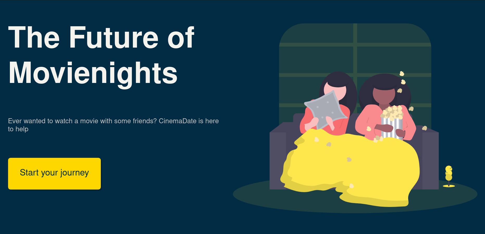
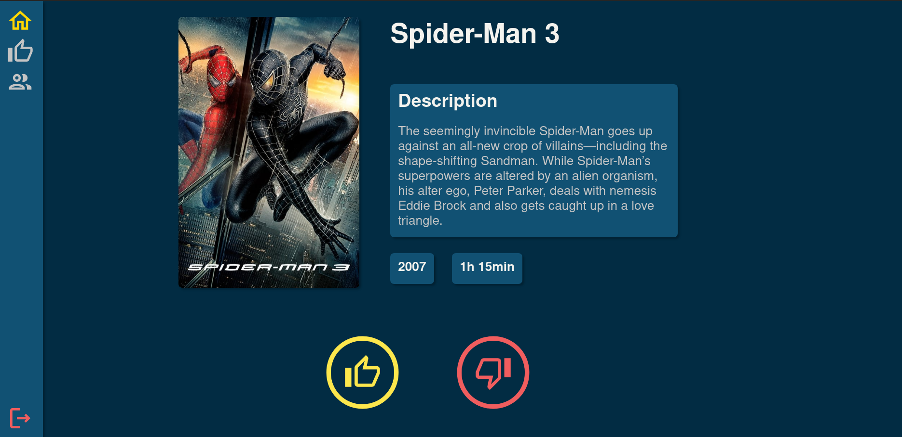
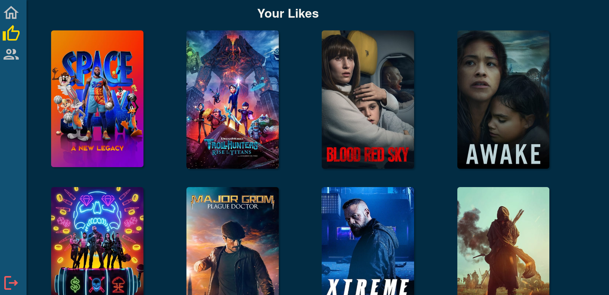

# About Cinemadate
Cinemadate can be found at [cinemadate.net](https://cinemadate.net/#/)

Cinemadate is a webapp designed to make choosing movies on Netflix as a group easier. The product is still in development but when finished it will as it's main feature give users possibilities to create sessions where they like/dislike the same movies. If everyone likes the same movie each member of the group is notified and they will be sent to Netflix

# How it works
## Frontend
The frontend is built using React and SCSS. It communicates with the REST-api using Axios.

## Backend
The backend is built using NodeJS with ExpressJS. MongoDB is used alongside the Moongoose framework as a database. When the product is finished the backend is meant to fetch the most popular movies on Netflix using [The moviedb api](https://www.themoviedb.org/). Currently the backend fetches movies using this API but it isn't schedueled so it requires a manual restart of the database. This will be automated when testing phase is done

## Hosting
The website alongside with the database is hosted using DigitalOcean

# Screenshots

